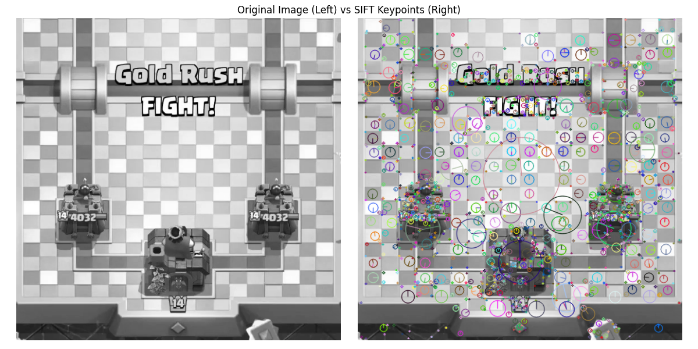

# XJTU CVPR2024 课程作业

作业格式:
```bash
- hw{id}
  - code  # 代码
  - figures  # 图片
  - tex  # latex源码
```

## hw1
1. 掌握图像的 SIFT 特征检测原理；
2. 掌握图像特征描述子的匹配度量（距离比），RANSAC 方法；
3. 完成图像的 SIFT 特征提取与匹配；
4. 完成基于单应矩阵 H（2D 射影变换）的图像视点变换与拼接；讨论图像融合方法
与鲁棒匹配/估计方法，以及多单应矩阵的图像拼接


## hw2
1. 基于两层神经网络的图像分类器；
2. 学习使用 PyTorch 深度学习框架搭建图像分类器；
3. 学习使用常用 CNN 结构和图像增强技术．

用WideResNet训练CIFAR10达到96.44%准确率
|loss|train acc|eval acc|
|-|-|-|
||||
